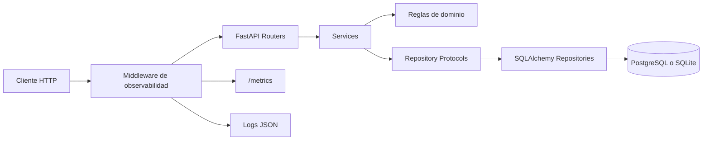

# SensorHub

SensorHub es una API REST construida con FastAPI para administrar sensores, registrar lecturas, detectar anomalías, consultar alertas y exponer capacidades básicas de monitoreo del servicio.

## Funcionalidades principales

- gestión de sensores con ubicación, umbral de alerta y desactivación lógica
- ingesta de lecturas con validación física por tipo de sensor
- consulta paginada de lecturas por rango temporal
- detección de anomalías con severidades `WARNING` y `CRITICAL`
- gestión de alertas activas y transición entre `open`, `acknowledged` y `resolved`
- estadísticas por sensor y periodo con mínimo, máximo y promedio
- endpoint `/health`, métricas básicas en `/metrics` y logs estructurados JSON

## Arquitectura



Capas utilizadas:

- `routers`: definen contratos HTTP, parámetros, dependencias y respuestas
- `services`: concentran reglas de negocio y coordinación entre repositorios
- `repositories`: encapsulan persistencia y consultas SQLAlchemy
- `models`: representan entidades persistidas
- `domain`: contiene reglas puras como severidad de alertas, transiciones y estadísticas

## Requisitos de entorno

- Python `3.12`
- PostgreSQL `16` para smoke tests reales y despliegue
- Docker y Docker Compose para entorno local completo

## Variables de entorno

- `DATABASE_URL`: conexión a la base de datos
- `PORT`: puerto HTTP utilizado por el arranque en contenedor
- `LOG_LEVEL`: nivel del logger estructurado de la API

Si `DATABASE_URL` no está definida, el proyecto usa SQLite local en `sensorhub.db` como fallback de desarrollo.

## Ejecución local

1. Instalar dependencias

```bash
python -m pip install -r requirements-dev.txt
```

2. Aplicar migraciones

```bash
python -m alembic upgrade head
```

3. Levantar la API

```bash
python -m uvicorn app.main:app --reload
```

Endpoints útiles:

- `http://localhost:8000/docs`
- `http://localhost:8000/health`
- `http://localhost:8000/metrics`

## Ejecución con Docker Compose

1. Crear `.env` a partir de `.env.example`
2. Ajustar credenciales locales de PostgreSQL
3. Levantar servicios

```bash
docker compose up --build
```

Durante el arranque del contenedor de la API se ejecuta:

```bash
alembic upgrade head
```

## Calidad y validaciones

Validaciones principales del proyecto:

```bash
pytest
ruff check app tests migrations
mypy app tests migrations --ignore-missing-imports
```

La cobertura mínima exigida es `80 %`.

## CI/CD

El workflow de GitHub Actions ejecuta:

- Ruff
- mypy
- pytest con cobertura
- análisis de seguridad con Trivy
- smoke test funcional con PostgreSQL real

En cada `push` a `main`, después de pasar CI:

- se inicia un despliegue real en Render mediante `RENDER_API_KEY` y `RENDER_SERVICE_ID`
- se espera la finalización del deploy
- se valida el health check público configurado en `PRODUCTION_HEALTHCHECK_URL`

## Documentación adicional

- [ADR 0001: Arquitectura en capas](docs/adr/0001-arquitectura-en-capas.md)
- [ADR 0002: Observabilidad y monitoreo liviano](docs/adr/0002-observabilidad-y-monitoreo-liviano.md)
- [Bitácora consolidada de Semana 6](AI_LOG_SEMANA6.md)

## Endpoints de referencia

- `GET /health`
- `GET /metrics`
- `POST /sensors/`
- `PATCH /sensors/{sensor_id}`
- `POST /sensors/{sensor_id}/readings`
- `GET /sensors/{sensor_id}/readings`
- `GET /sensors/{sensor_id}/readings/stats`
- `GET /alerts/active`
- `PATCH /alerts/{alert_id}`
